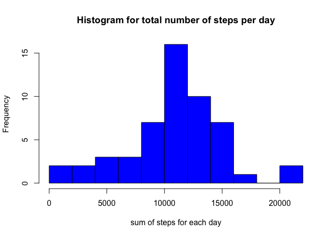
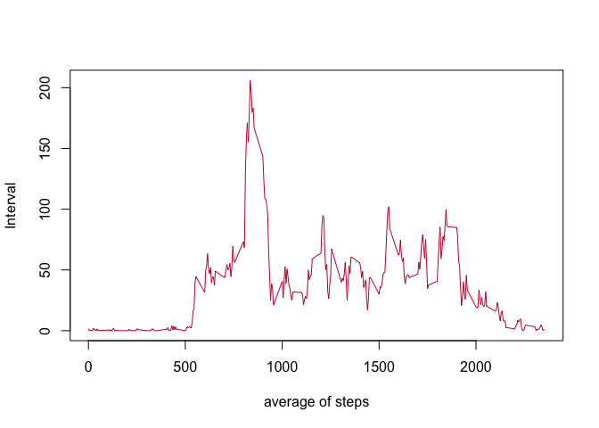
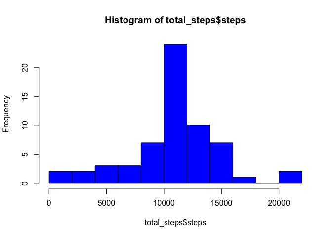
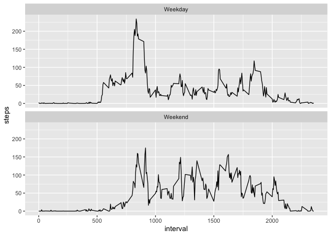

\#Assignment-1 Reproducible Research

*Load the data (i.e. read.csv()read.csv())* *Process/transform the data
(if necessary) into a format suitable for your analysis*

\#\#Explanation:- I have read the data in to data variable and displayed
the summary of the data

*Calculate the total number of steps taken per day*

\#\#Explanation:- 1. converted the date in to POSIXct format 2. saved
all the weekdays of the date in the weekday column. 3. calculated all
the steps per date using sum function 4. changed the names to date and
sum

    data$date<-as.POSIXct(data$date,"%Y-%m-%d", tz="GMT")
    weekday <- weekdays(data$date)
    data <- cbind(data,weekday)

    data$weekday<- as.factor(data$weekday)
    table(data$weekday)

    ## 
    ##    Friday    Monday  Saturday    Sunday  Thursday   Tuesday Wednesday 
    ##      2592      2592      2304      2304      2592      2592      2592

    #data$steps
    summary(data)

    ##      steps             date               interval           weekday    
    ##  Min.   :  0.00   Min.   :2012-10-01   Min.   :   0.0   Friday   :2592  
    ##  1st Qu.:  0.00   1st Qu.:2012-10-16   1st Qu.: 588.8   Monday   :2592  
    ##  Median :  0.00   Median :2012-10-31   Median :1177.5   Saturday :2304  
    ##  Mean   : 37.38   Mean   :2012-10-31   Mean   :1177.5   Sunday   :2304  
    ##  3rd Qu.: 12.00   3rd Qu.:2012-11-15   3rd Qu.:1766.2   Thursday :2592  
    ##  Max.   :806.00   Max.   :2012-11-30   Max.   :2355.0   Tuesday  :2592  
    ##  NA's   :2304                                           Wednesday:2592

    sum_steps<-aggregate(data$steps, by=list(Group=data$date), FUN=sum)

    names(sum_steps)<-c("date","sum")
    #names(sum_steps)

*If you do not understand the difference between a histogram and a
barplot,* *research the difference between them. Make a histogram of the
total number of* *steps taken each day*

\#Explanation:-

used hist function for total number of steps per day

    hist(sum_steps$sum,breaks = 10,col = "blue",xlab="sum of steps for each day", main ="Histogram for total number of steps per day")

Calculate and report the mean and median of the total number of steps
taken per day \#\#Mean

    mean(sum_steps$sum,na.rm = TRUE)

    ## [1] 10766.19

\#\#Median

    median(sum_steps$sum,na.rm = TRUE)

    ## [1] 10765

\#What is the average daily activity pattern?

*Make a time series plot (i.e. type = “l”type =* *“l”) of the 5-minute
interval (x-axis) and the average number of steps taken,* *averaged
across all days (y-axis)*

\#Explanation:- 1. calculated mean of steps per 5 minute interval. 2.
then plotted the mean for intervals

    sum_steps_interval<-aggregate(data$steps, by=list(data$interval), FUN=mean, na.rm=TRUE,simplify=T)
    str(sum_steps_interval)

    ## 'data.frame':    288 obs. of  2 variables:
    ##  $ Group.1: int  0 5 10 15 20 25 30 35 40 45 ...
    ##  $ x      : num  1.717 0.3396 0.1321 0.1509 0.0755 ...

    names(sum_steps_interval)<-c("interval","sum_steps")
    plot(sum_steps_interval$interval,sum_steps_interval$sum_steps,type="l",xlab="average of steps",ylab="Interval",
         col="#C70039")

Which 5-minute interval, on average across all the days in the dataset,
contains the maximum number of steps?

    sum_steps_interval[which.max(sum_steps_interval$sum_steps),]$interval

    ## [1] 835

\#Imputing missing values

*Note that there are a number of days/intervals where there are missing
values* *(coded as NANA). The presence of missing days may* *introduce
bias into some calculations or summaries of the data.*

1.  Calculate and report the total number of missing values in the
    dataset (i.e. the total number of rows with NANAs)\*

<!-- -->

    na_sum<-is.na(data)
    table(na_sum)

    ## na_sum
    ## FALSE  TRUE 
    ## 67968  2304

1.  Devise a strategy for filling in all of the missing values in the
    dataset. The strategy does not need to be sophisticated. For
    example, you could use the mean/median for that day, or the mean for
    that 5-minute interval, etc.

<!-- -->

    fill_data<-sum_steps_interval$sum_steps[match(data$interval,sum_steps_interval$interval)]

Create a new dataset that is equal to the original dataset but with the
missing data filled in.

    new_data <- transform(data, steps = ifelse(is.na(data$steps), yes = fill_data, no = data$steps))
    total_steps <- aggregate(steps ~ date, new_data, sum)
    names(total_steps) <- c("date", "steps")
    head(total_steps)

    ##         date    steps
    ## 1 2012-10-01 10766.19
    ## 2 2012-10-02   126.00
    ## 3 2012-10-03 11352.00
    ## 4 2012-10-04 12116.00
    ## 5 2012-10-05 13294.00
    ## 6 2012-10-06 15420.00

Make a histogram of the total number of steps taken each day and
Calculate and report the mean and median total number of steps taken per
day. Do these values differ from the estimates from the first part of
the assignment? What is the impact of imputing missing data on the
estimates of the total daily number of steps?

    hist(total_steps$steps, col="blue", breaks=10)

    mean(total_steps$steps)

    ## [1] 10766.19

    median(total_steps$steps)

    ## [1] 10766.19

Are there differences in activity patterns between weekdays and
weekends?

or this part the weekdays()weekdays() function may be of some help here.
Use the dataset with the filled-in missing values for this part.

1.  Create a new factor variable in the dataset with two levels –
    “weekday” and “weekend” indicating whether a given date is a weekday
    or weekend day.

<!-- -->

    library(chron)
    data$date <- as.Date(strptime(data$date, format="%Y-%m-%d"))

    data$week <- sapply(data$date, function(x) {
            if (weekdays(x) == "Saturday" | weekdays(x) =="Sunday") 
                    {y <- "Weekend"} else 
                    {y <- "Weekday"}
                    y
            })

    table(data$week)

    ## 
    ## Weekday Weekend 
    ##   12960    4608

1.  Make a panel plot containing a time series plot (i.e. type = “l”type
    = “l”) of the 5-minute interval (x-axis) and the average number of
    steps taken, averaged across all weekday days or weekend days
    (y-axis). See the README file in the GitHub repository to see an
    example of what this plot should look like using simulated data.

<!-- -->

    library(ggplot2)
    ggplot_Data <- aggregate(steps~interval + week, data, mean, na.rm = TRUE)
    p<- ggplot(ggplot_Data , aes(x= interval, y= steps))+facet_wrap(~week, ncol=1, nrow=2)+geom_line()
    p

